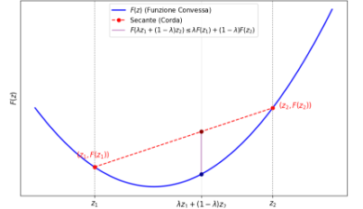
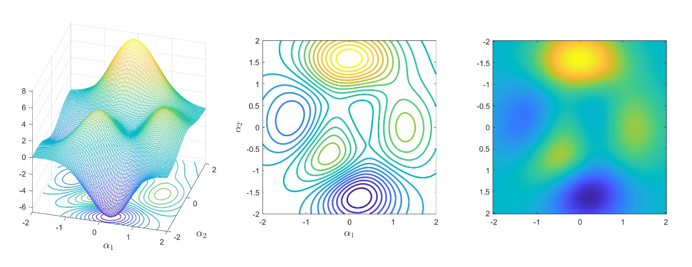

# (33) Lezione 18-05-2026 | s 370.. | Introl al capitolo

## Minimi quadrati non lineari

### Costruzione matrice di regressione non possibile

Qua il legame tra le FEATURES ed i parametri non è più lineare come abbiamo visto prima.

$$
\min_{\alpha\R^{n+1}} \sum_{i=1}^n\left(f(\alpha_0,\ldots,\alpha_n;x^{(i)})-y_i\right)^2
$$

L'idea dei minimi quadrati rimante. Ma se le $\alpha$ sono dimendenti tra loro in un modo non lineare allora non possiamo più riscrivere il problema di minimo come il sistema:

$$
Q(\alpha) = \|A\alpha-y\|^2
$$

Vengono a mancare tutti gli algoritmi visti fin'ora, non vanno più bene. Abbiamo sempre avuto una matrice dei valori ed un vattore dei parametri ma non possiamo più ottenere questa forma.

---

### Alcuni Esempi

#### Esempio 1: un problema di dinamica delle popolazioni (modello esponenziale)

Descrive la crescita della popolazione di antilopi con una funzione esponenziale a due parametri:

$$
f(\alpha_0,\alpha_1;x) = \alpha_0e^{\alpha_1x}
$$

Vogliamo trovare i due parametri $\alpha_0\alpha_1$ che minimizzano la funzione:

$$
F(\alpha_0,\alpha_1) = \sum_{i=1}^m \left( \alpha_0e^{\alpha_1x} - y_i \right)^2
$$

Abbiamo una somma che viaggia sul numero di esempi che abiamo nel dataset. Quello che cambia è il valore della risposta $y_i$ ed il valore di $x_i$.

I parametri possono essere anche pochi, ma calcolare la funzione può diventare molt ocostosa, basti pensare ad avere 1 miln di esempi. Quindi il costo dipende da:
- Numero dei parametri
- Numero degli esempi

#### Esempio 2: un problema di dinamica delle popolazioni (modello logistico)

Nel modello esponenziale, si assume che il tasso di crescita della popolazione sia costante nel tempo. In realtà il tasso di accrescimento delle popolazioni dopo un certo periodo si stabilizza.

Dati: $(x_i,y_i)$, numerosità della popolazione italiana rilevata dai censimenti a ca- denza decennale dal 1861 al 2021. Trovare i parametri $\alpha_0,\alpha_1,\alpha_2$ del modello logistico:

$$
f(\alpha_0,\alpha_1,\alpha_2;x) = \frac{\alpha_0}{1+e^{-\alpha_1(x-\alpha_2)}}
$$

[Immagine Modello Logistico](https://upload.wikimedia.org/wikipedia/commons/thumb/f/f1/Logistic-sigmoid-vs-scaled-probit.svg/960px-Logistic-sigmoid-vs-scaled-probit.svg.png)

### Inversione del problema - Problemi di massimo e monimo

**Nota**: Possiamo invertire il problema cambiando il segno della funzione e cercare di massimizzarla (problema di massimo). Ma in genere si impone il problema come di minimo.

Ad esempio nel caso di una parabola. L'ascissa del minimo locale coincide tra la funzione prabola e la sua opposta, cambia l'ordinata. A seconda del caso si modella un problema di minimo o massimo.

$$
\min_{\alpha\in\R^n} F(\alpha) \quad\Leftrightarrow\quad \max_{\alpha\in\R^n} -F(\alpha)
$$

---

### Struttura del problema

Vogliamo trovare il punto di minimo di una funzione data, chiamata **funzione obiettivo**.

$$
\min_{\alpha\in\R^n} F(x)
$$

dove $F$ è:

$$
F(\alpha_0,\alpha_1) = \sum_{i=1}^m \left( \alpha_0e^{\alpha_1x} - y_i \right)^2
$$

Si vuole trovare il minimo di una funzione $F : \R^n\to\R$.

Si tratta di un problema di ottimizzazione numerica nonlineare anche detto di programmazione matematica nonlineare.

### Punto di minimo Locale e Globale (la soluzione che cerchiamo)

Un $\alpha^*\in\R^n$ è un punto di **minimo locale** per il funzionale $F : \R^n\to\R$ se esiste $\epsilon>0$ tale che:

$$
F(\alpha^*)\le F(\alpha) \qquad\forall\alpha\in\{z\in\R^n : \|z-\alpha^*\|\le\epsilon\}
$$

Se la disuguaglianza vale per ogni $\alpha\in\R^n$, allora $\alpha^*$ si dice punto di **minimo globale** $F$.

**Nota**: Non è mai garantita l'esistenza di un minimo locale/globale e nemmeno l'unicità. Ad esempio l'esponenziale non ha un punto di minimo, ha un punto "iniziale" a sinistra ma non è un minimo.

Vogliamo quindi trovare un algoritmo che ciconsenta di trovare questi punti di minimo in problemi a 1,2,... dimensioni.

---

# (34) Lezione 19-05-2026 | s 370..389 | Condizioni di ottimalità per funzioni differenziabili. Metodo del gradiente e sue proprietà di convergenza

## Minimi quadrati non lineari

### Il nostro obiettivo in termini di punti di minimo

Non esiste un metodo generale che ci consente di trovare sempre il minimo globale di una funzione. Il più delle volte si risce a trovare (se possiile) un punto di mininmo locale e non si è sicuri che coincida con il minimo globale.

Il nostro obiettivo è quello ti trovare un punto di minimo della funzione.

## 1. Condizioni necessarie di ottimialità (funzioni Convesse)

### Teorema di Fermat

Sono degli insiemi di uguaglianze che servono per caratterizzare in altro modo i punti di minimo locale di una funzione. Siamo in grado di valutare un'uguaglianza.

Sia $F : \R \to \R$ una funzione differenziabile con continuità e sia $\alpha^*\in\R$ un suo punto di minimo locale. Allora si ha

$$
F'(\alpha^*) = 0 \;.
$$

- La derivata prima di $F$ calcolata nel punto $\alpha^*$ si annulla.
- Tutti i punti di minimo soddisfano l'equazione $F'(\alpha^*) = 0$.

Non è sempre vero il contrario. Se la derivata prima si annulla in un punto $\alpha$ non è detto che qual punto sia di minimo locale.
- Il viceversa è garantito solo sotto certe ipotesi, per esempio **se la funzione $F$ è convessa**.
- Per capire se una funzione è convessa oppure no ci basta guardare la derivata seconda. Se la **derivata seconda è $>0$** allora la funzione è convessa. Ma non è sempre possibile.

**La vera definizione di Convessità**:

Una funzione $F : \R^n\to\R$ si dice convessa se:

$$
F(\lambda z_1 + (1-\lambda)z_2) \le \lambda F(z_1) + (1-\lambda) F(z_2), \qquad\forall\lambda\in[0,1],\text{ con } z_1,z_2\in\R^n
$$

Scegliendo il parametro $\lambda$ e consideriamo il punto $\lambda z_1 + (1-\lambda)z_2$ con $0\le\lambda\le1$.

Linterpretazione della condizione ci dice che la funzione sta al di sotto della retta passante per i punti $z_1$ e $z_2$ nell'intervallo $[z_1,z_2]$.

> **Teo**. Se $F:\R\to\R$ è differenziabile, $F$ è convessa in $R$ se e solo se $F^n(\alpha)\ge0\;\forall\alpha\in\R$.

#### Condizioni necessarie e sufficienti di ottimalità **per funzioni convesse**

> **Teo**. Se $F:\R\to\R$ è convessa e $\alpha^*$ è un punto di minimo locale, allora è anche un punto di minimio globale.

> **Teo**. Se $F:\R\to\R$ è convessa, allora $\alpha^*$ è un punto di minimo locale se e solo se $F'(\alpha^*) = 0$.

Per le funzioni convesse i punti di minimo (globale) sono tutti e soli le soluzioni dell’equazione $F'(\alpha^*) = 0$.

> **NOTA IMPORTANTE**: La convessità da sola non ci dice che per forza abbiamo un punto di minimo locale. Potrebbe non esistere anche se la funzione è convessa. Basti pensare alla funzione esponenziale.

### Gradiente e teorema di Fermat in $n$ dimensioni

Sia $F:\R^n\to\R$ e sia $\bar\alpha\in\R^n$. La derivata parziale di $F$ nel punto $\bar\alpha$ rispetto alla variabile $\alpha_i$ è definita come

$$
\frac{\partial F}{\partial\alpha_i}(\bar\alpha) = \lim_{h\to0} \frac{F(\bar\alpha_1,\ldots,\bar\alpha_i+h,\ldots,\bar\alpha_n) - F(\bar\alpha)}h, \qquad i=1,ldots,n
$$

Il gradiente di $F$ in $\bar\alpha$ è i lvettore di $\R^n$ definito come

$$
\nabla F(\bar\alpha) = \begin{pmatrix}
\frac{\partial F}{\partial\alpha_1}(\bar\alpha) \\ \vdots \\ \frac{\partial F}{\partial\alpha_n}(\bar\alpha)
\end{pmatrix}
$$

### Processo di ottenimento della forma del sistema con graduente (con esempio popolazione exp.)

Passare dal problema generico ad una forma che usa il gradiente:

Partiamo con le coppie e la funzione:

$$
(x_i,y_i), \qquad i=1,\ldots,m
$$

$$
f(\alpha,x) = \alpha_0 e^{\alpha_1x}
$$

Per il metodo dei Minimi Quadrati otteniamo:

$$\boxed{
F(\alpha) = \sum_{i=1}^m \left( f(\alpha,x_i)-y_i \right)^2
}$$

A questo punto introduciamo il gradiente applicando le opportune derivate parziali

$$\begin{aligned}
\frac{\partial F(\alpha)}{\partial\alpha_0}
&= \sum_{i=1}^m 2\left( f(\alpha,x_i)-y_i \right)\cdot\frac{\partial f(\alpha;x_i)}{\partial\alpha_i} 
= 2\sum_{i=1}^m \left( \alpha_0 e^{\alpha_1x_i}-y_i \right)\cdot e^{\alpha_1x_i}
\end{aligned}$$

$$\begin{aligned}
\frac{\partial F(\alpha)}{\partial\alpha_1}
&= \sum_{i=1}^m 2\left( f(\alpha,x_i)-y_i \right)\cdot\frac{\partial f(\alpha;x_i)}{\partial\alpha_i} 
= 2\sum_{i=1}^m \left( \alpha_0 e^{\alpha_1x_i}-y_i \right)\cdot \alpha_0x_ie^{\alpha_1x_i}
\end{aligned}$$

Alcuni parametri possono essere calcolati in principio e riutilizzati. Ad esempio $(\alpha_0 e^{\alpha_1x_i}-y_i)$.

Queste formule saranno poi implementate in un algoritmo. Vedi esempi in laboratorio.

---

## 2. Condizioni necessarie di ottimialità (in $\R^n$)

### Teorema di Fermat

Sono degli insiemi di uguaglianze che servono per caratterizzare in altro modo i punti di minimo locale di una funzione. Siamo in grado di valutare un'uguaglianza.

Sia $F : \R^n \to \R$ una funzione che ha derivate parziali continue in tutti i punti di $\R^n$ e sia $\alpha^*\in\R^n$ un suo punto di minimo locale. Allora si ha

$$
\nabla F(\alpha^*) = 0 \;.
$$

- La derivata prima di $F$ calcolata nel punto $\alpha^*$ si annulla.
- Tutti i punti di minimo sono le radici del sistema di equazioni non lineari $\nabla F'(\alpha)=0$.

    Avremo quindi un sistema di equazioni non lineari. Ad esempio nel caso della popolazione esponenziale:

    $$\begin{cases}
    \sum_{i=1}^m \left( \alpha_0 e^{\alpha_1x_i}-y_i \right)\cdot e^{\alpha_1x_i}
    \sum_{i=1}^m \left( \alpha_0 e^{\alpha_1x_i}-y_i \right)\cdot \alpha_0x_ie^{\alpha_1x_i}
    \end{cases} \to \nabla F(\alpha) = 0$$

- Il viceversa è vero solamente per le funzioni convesse.

Indichiamo le radici del sistema $\nabla F(\alpha)$ come i **punti stazionari** di $F$. Un punto di minimo è un punto stazionario, ma non è vero il viceversa.
- Nel caso delle funzioni convesse, l'insieme dei punti stazionari coincide interamente con l'insieme dei punti di minimo.

> **Nota**. Non esistono algoritmi che garantiscano, per funzioni NON convesse, di individuare un punto di minimo. Dal punto di vista teorico non c'è questa garanzia.

### Metodo del Gradiente

Consideriamo il problema di ottimizzazione nella variabile $\alpha\in\R^n$

$$
\min_{\alpha\in\R^n} F(\alpha)
$$

Si tratta di un metodo iterativo. Come tutti i metodi iterativi va scelto un punto iniziale che chiamiamo

$$
\alpha^{(0)}\in\R^n
$$

La formula è molto semplice. Si prende l'iterato corrente e gli togliamo il gradiente della funzione obiettivo calcolato sull'iterata corrente moltiplicato per un parametro positivo che viene chiamato **paramtero di "steplength"**.

Per capire meglio come funziona impostiamo il problema per grado 2.
- Vediamo le alpha come i punti nel piano. E noi vogliamo scegliere la direzione opposta del gradiente (antigradiente). Quanto ci spostiamo sull'antigradiente? Questo è determinato dal parametro "lunghezza di passo".
- Iterando il procedimento ci dirigeremo verso un punto stazionario che non è detto essere un punto di minimo. Purtroppo non possiamo distinguere i punti di minimo da quelli stazionari.

Quindi è richiesto ad ogni iterata di calcolare il nuovo gradiente.

#### Parametro di lunghezza del passo:

Il valore del parametro $\gamma_k$ (lunghezza di passo) comporta una aumento/diminuzione della velocità di convergenza del metodo. Esistono più modi della scelta del valore del parametro:
1. Variante a passo fisso;
2. Passo che cambia ad ogni iterata.

### Proprietà di discesa del metodo del gradiente in $\R$

Abbiamo dimostrato che il metodo funziona per $\gamma_k = \gamma$ costante con le formule derivate dal teorema di Taylor.

Dimostrato la **proprietà di discesa** del metodo del gradiente.

$F(\alpha)$ è il punto in cui siamo.
$F(\alpha - \gamma F'(d))$ è il nuovo punto, dove $\gamma$ indica di quanto ci spostiamo.

Il fattore $\gamma$ deve rispettare la disuguaglianza:

$$
\gamma<\frac2L
$$

> **Osservazione**. Se ci spostiamo in direzione opposta al gradiente, per uno spostamento γ sufficientemente piccolo troviamo un punto in cui la funzione ha un valore inferiore rispetto al punto di partenza.

Si arriva alla stessa conclusione per $n$ dimensioni.

---