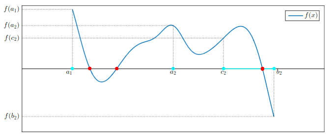
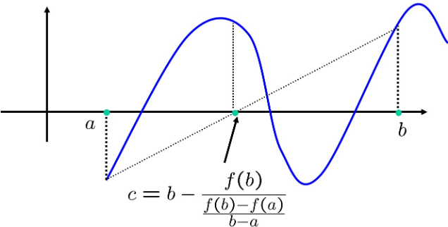

# Metodi Non-Lineari

## Metodi per equazioni nonlineari

Sia $f : [a,b] \to \mathbb{R}$. L’obiettivo è determinare un punto $x_* \in [a,b]$ tale che $f(x_*) = 0$. Un tale punto viene detto radice (o zero) della funzione.

In questa prima fase si considera il caso di una sola equazione in una sola incognita, con l’idea di costruire metodi numerici che permettano di approssimare la soluzione quando non è possibile determinarla in forma analitica.

---

### ▸ Teorema degli zeri (o teorema di esistenza)

Si considera una funzione continua $f$ definita su un intervallo $[a,b]$. Se i valori della funzione agli estremi dell’intervallo hanno segno opposto, cioè:

$$
f(a)\cdot f(b) < 0
$$

allora esiste almeno un punto $x_* \in (a,b)$ tale che

$$
f(x_*) = 0.
$$

Questo risultato fornisce una **condizione sufficiente** per garantire l’esistenza di almeno una radice nell’intervallo.

Non assicura invece l’unicità, a meno che non si imponga una condizione aggiuntiva.

In particolare, se la funzione è **strettamente monotona** nell’intervallo, allora **la radice**, se esiste, **è unica**.

### ▸ Mal condizionamento di un'equazione nonlineare

Un'equazione nonlineare $f(x)=0$ è **mal condizionata** quando una piccola perturbazione nei dati del problema, ad esempio nei valori di $f$, può produrre una variazione significativa nella soluzione $x^*$.

Geometricamente, il problema tende a essere mal condizionato quando il grafico di $f$ interseca l'asse $x$ con una **pendenza molto piccola**, cioè quando

$$
|f'(x^*)|\approx 0.
$$

In questo caso il grafico è **quasi tangente all'asse orizzontale** in corrispondenza della radice e una piccola perturbazione della funzione può causare uno spostamento significativo della radice.

Al contrario, se

$$
|f'(x^*)|
$$

è grande, la radice è generalmente più stabile rispetto a piccole perturbazioni della funzione.

---

# Metodi iterativi per la ricerca degli zeri

I metodi numerici per la ricerca delle radici sono generalmente **iterativi**: a partire da un intervallo iniziale che contiene almeno una radice, si costruisce una successione di intervalli sempre più piccoli che convergono verso la soluzione.

Tra questi, si distinguono i **metodi dicotomici**, tra cui il metodo di bisezione e il metodo della regula falsi (o falsa posizione). Entrambi sfruttano il teorema degli zeri e richiedono come ipotesi iniziale un intervallo in cui la funzione cambia segno.

---

## 1) Metodo di bisezione

Il metodo di bisezione richiede come dato iniziale un intervallo $[a_0, b_0]$ tale che $f(a_0)\cdot f(b_0) < 0$, ovvero **un intervallo che contiene almeno una radice**.

Ad ogni iterazione si considera il punto medio dell’intervallo corrente:

$$
c_k = \frac{a_k + b_k}{2}
$$

Si valuta il segno di $f(c_k)$ e si seleziona il sottointervallo in cui la funzione continua a cambiare segno.

$$
[a_{k+1},b_{k+1}]=
\begin{cases}
[a_k,c_k] & \text{se } f(c_k)f(a_k)<0, \\[2mm]
[c_k,b_k] & \text{se } f(c_k)f(b_k)<0.
\end{cases}
$$

<!-- Immagine Centrata -->

    

In questo modo si costruisce una successione di intervalli annidati:

$$
[a_0,b_0] \supset [a_1,b_1] \supset [a_2,b_2] \supset \cdots
$$

che continuano a contenere almeno una radice della funzione.

Se la funzione è continua, allora per ogni iterazione vale:

$$
\exists x_* \in [a_k, b_k] \quad \text{tale che} \quad f(x_*) = 0
$$

Il processo restringe progressivamente l’intervallo, e la **lunghezza dell’intervallo si dimezza ad ogni iterazione**. Dopo $k$ iterazioni, la lunghezza dell’intervallo è:

$$
b_k - a_k = \frac{b_0 - a_0}{2^k}
$$

Il punto medio $c_k$ rappresenta un’approssimazione della radice. L’errore assoluto massimo tra $c_k$ e la soluzione $x_*$ è limitato da metà della lunghezza dell’intervallo:

$$
|c_k - x_*| \le \frac{b_k - a_k}{2} = \frac{b_0 - a_0}{2^{k+1}}
$$

In molti contesti si usa una stima equivalente (a fattore costante vicino) del tipo:

$$
|c_k - x_*| \le \frac{b_0 - a_0}{2^k}
$$

---

### ▹ Criterio di arresto

Il metodo di bisezione è uno dei pochi metodi per cui è possibile **controllare a priori la distanza dalla soluzione**. Si introduce una tolleranza $\tau > 0$ e si interrompe l’algoritmo quando l’intervallo è sufficientemente piccolo:

$$
b_k - a_k \le \tau
$$

Siccome:

$$
b_k - a_k = \frac{b_0 - a_0}{2^k}
$$

si ottiene la condizione:

$$
\frac{b_0 - a_0}{2^k} \le \tau
$$

da cui:

$$
2^k \ge \frac{b_0 - a_0}{\tau}
$$

e quindi il numero minimo di iterazioni richiesto è:

$$
\boxed{
k \ge \log_2\!\left(\frac{b_0 - a_0}{\tau}\right)
}
$$

Questo risultato evidenzia che il metodo di bisezione **converge con velocità logaritmica** rispetto alla precisione richiesta. In altre parole, per migliorare la precisione di un fattore 2 è sufficiente una sola iterazione in più.

Dopo $k$ iterazioni, il punto medio $c_k$ soddisfa una stima dell’errore del tipo:

$$
|c_k - x_*| \le \frac{b_0 - a_0}{2^k} \le \tau
$$

Quindi, una volta raggiunto tale numero di iterazioni, si ha la garanzia che la distanza tra l’approssimazione $c_k$ e la radice $x_*$ è inferiore alla tolleranza fissata, e dunque l’approssimazione è considerata accettabile.

---

### ▹ Osservazione sul calcolo del punto medio

Per calcolare il punto medio di un intervallo $[a,b]$ si possono utilizzare due formule matematicamente equivalenti:

$$
c = \frac{a + b}{2} \qquad \text{oppure} \qquad c = a + \frac{b - a}{2}
$$

Dal punto di vista numerico, però, le due espressioni non sono equivalenti in termini di stabilità.

La formula più immediata, $c = (a + b)/2$, può risultare numericamente instabile quando $a$ e $b$ sono numeri molto grandi (in valore assoluto) o molto vicini tra loro. In questi casi, la somma $a + b$ può introdurre errori di arrotondamento significativi (overflow o perdita di cifre significative).

Per questo motivo si preferisce utilizzare la forma:

$$
\boxed{
c = a + \frac{b - a}{2}
}
$$

Questa espressione è algebraicamente equivalente, ma numericamente più stabile, perché evita di sommare direttamente due numeri potenzialmente grandi e riduce il rischio di perdita di precisione.

Va comunque osservato che anche questa seconda formula non elimina completamente gli errori di arrotondamento, ma nella pratica fornisce risultati più accurati e robusti.

---

### ▹ Costo computazionale nei metodi per equazioni non lineari

Nello studio dei metodi numerici, l’implementazione degli algoritmi è progettata per ridurre al minimo il costo computazionale.

Una funzione non lineare $f(x)$ non viene calcolata esattamente a livello macchina, ma viene approssimata tramite algoritmi numerici che la riconducono a una sequenza di operazioni aritmetiche elementari (ad esempio somme, prodotti, divisioni).

Per questo motivo, il costo computazionale complessivo di un metodo iterativo può essere modellato come:

$$
\mathcal{O}(n \cdot \text{costo}(f))
$$

dove $n$ è il numero di iterazioni e $\text{costo}(f)$ rappresenta il costo di una singola valutazione della funzione.

In questo contesto, è naturale considerare la funzione $f$ come un **“blocco” (o pacchetto) di operazioni elementari**. Invece di contare ogni singola operazione aritmetica, si conta quante volte viene valutata la funzione, poiché questo rappresenta la parte dominante del costo.

Di conseguenza, una misura pratica dell’efficienza di un metodo è **il numero di valutazioni di funzione per iterazione**. Ridurre questo numero significa rendere il metodo più efficiente, a parità di numero di iterazioni.

Nel caso del metodo di bisezione, ogni iterazione richiede una sola nuova valutazione della funzione (nel punto medio $c_k$). Le valutazioni agli estremi dell’intervallo possono infatti essere riutilizzate dalle iterazioni precedenti.

Pertanto, il costo computazionale per iterazione del metodo di bisezione è costante e pari a una valutazione di funzione, rendendolo un metodo semplice e prevedibile dal punto di vista computazionale, anche se **non tra i più veloci** in termini di convergenza.

---

## 2) Metodo di Regula Falsi

Il metodo di regula falsi (o metodo della falsa posizione) appartiene, insieme al metodo di bisezione, alla **famiglia dei metodi dicotomici**. Anche in questo caso si parte da un intervallo iniziale $[a_0, b_0]$ tale che:

$$
f(a_0)\cdot f(b_0) < 0
$$

quindi si assume che la funzione sia continua e che esista almeno una radice nell’intervallo.

La differenza principale rispetto al metodo di bisezione riguarda la scelta del punto $c_k$. Invece di prendere il punto medio dell’intervallo, il metodo di regula falsi utilizza un’**approssimazione lineare della funzione**: 

<!-- Immagine Centrata -->

    

si considera la retta secante che passa per i punti $(a_k, f(a_k))$ e $(b_k, f(b_k))$, e si prende come nuovo punto l’intersezione di questa retta con l’asse $x$.

La formula del punto $c_k$ è:

$$
c_k = b_k - \frac{f(b_k)}{\dfrac{f(b_k) - f(a_k)}{b_k - a_k}}
$$

che può essere riscritta in forma più compatta come:

$$
\boxed{
c_k = b_k - f(b_k)\,\frac{b_k - a_k}{f(b_k) - f(a_k)}
}
$$

Questo punto rappresenta una stima migliore della radice rispetto al punto medio, poiché tiene conto dei valori della funzione agli estremi dell’intervallo.

Una volta calcolato $c_k$, si procede in modo analogo al metodo di bisezione: si valuta $f(c_k)$ e si seleziona il sottointervallo in cui la funzione cambia segno, costruendo così una nuova coppia $(a_{k+1}, b_{k+1})$.

Il metodo genera quindi una successione di intervalli che continuano a contenere la radice, garantendo la convergenza sotto le stesse ipotesi di continuità.

Dal punto di vista implementativo, il metodo è molto simile a quello di bisezione: l’unica differenza consiste nella formula utilizzata per calcolare $c_k$. Anche in questo caso, il costo per iterazione è dominato dalla valutazione della funzione $f$, e si ha una sola nuova valutazione per iterazione.

Rispetto alla bisezione, il metodo di regula falsi può **convergere più rapidamente in molti casi**, poiché **sfrutta l’andamento della funzione**. Tuttavia, in alcune situazioni può **rallentare significativamente** (ad esempio quando uno degli estremi rimane quasi fisso), rendendo la convergenza non uniforme.

---

## Velocità di convergenza dei metodi dicotomici

Per analizzare la velocità di convergenza di un metodo iterativo, invece di osservare direttamente quanto una singola iterata $c_k$ si avvicina alla soluzione $x_*$, è utile confrontare l’**errore tra iterate successive**.

Nel caso del metodo di bisezione, sappiamo che vale la stima:

$$
|c_k - x_*| \le \frac{b_0 - a_0}{2^k}
$$

che possiamo interpretare, in modo approssimato, come:

$$
|c_k - x_*| \approx \frac{b_0 - a_0}{2^k}
$$

Considerando allora l’iterata successiva, otteniamo:

$$
|c_{k+1} - x_*| \approx \frac{b_0 - a_0}{2^{k+1}} = \frac{1}{2}\,\frac{b_0 - a_0}{2^k} \approx \frac{1}{2}|c_k - x_*|
$$

Questo mostra che, ad ogni iterazione, l’errore viene circa dimezzato. Si parla quindi di **convergenza lineare** con fattore di riduzione (*C*) pari a $\frac{1}{2}$.

Dal punto di vista pratico, questo implica che il numero di cifre corrette cresce lentamente: tipicamente si guadagna circa una cifra decimale ogni 3 o 4 iterazioni.

Di conseguenza, il metodo di bisezione è **molto robusto** — richiede ipotesi deboli (continuità e cambio di segno) e ha un costo computazionale contenuto per iterazione — ma risulta poco efficiente quando si desidera un’elevata precisione, poiché richiede un **numero elevato di iterazioni**.

---
