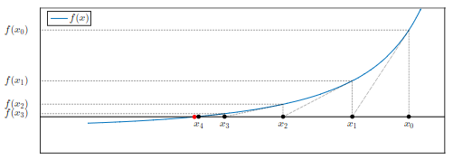

# Metodo di Newton

Il metodo di bisezione non è facilmente estendibile al caso di sistemi di equazioni non lineari o funzioni in più variabili.

Per questo motivo si introduce il **metodo di Newton**, che rappresenta uno dei metodi più importanti ed efficienti per la ricerca degli zeri.

L’idea alla base del metodo è di tipo geometrico:

<!-- Immagine Centrata -->

    

dato un punto iniziale $x_k$, si considera la retta tangente al grafico della funzione nel punto $(x_k, f(x_k))$ e si prende come nuova approssimazione $x_{k+1}$ l’intersezione tra questa retta e l’asse delle ascisse.

L’equazione della retta tangente nel punto $(x_k, f(x_k))$ è:

$$
y = f(x_k) + f'(x_k)(x - x_k)
$$

Per trovare l’intersezione con l’asse $x$, si impone $y = 0$:

$$
0 = f(x_k) + f'(x_k)(x - x_k)
$$

Risolvendo rispetto a $x$, si ottiene:

$$
x = x_k - \frac{f(x_k)}{f'(x_k)}
$$

Da cui deriva la formula iterativa del metodo di Newton:

$$
\boxed{
x_{k+1} = x_k - \frac{f(x_k)}{f'(x_k)}
}
$$

## Ipotesi di applicabilità

Affinché il metodo sia ben definito, è necessario che:

$$
f'(x_k) \neq 0
$$

per ogni iterazione, altrimenti la formula non è applicabile (divisione per zero).

Inoltre, per garantire una buona convergenza, si richiede generalmente che la funzione sia sufficientemente regolare (derivabile) e che il punto iniziale $x_0$ sia scelto vicino alla radice.

L’ipotesi $f'(x) \neq 0$ in un intorno della soluzione implica che la funzione è **localmente monotona**, ma è importante notare che **non è necessario che sia globalmente strettamente monotona** su tutto l’intervallo.

---

## Complessità computazionale del metodo di Newton

Nel metodo di Newton, il costo computazionale per singola iterazione è maggiore rispetto al metodo di bisezione. Questo perché, ad ogni passo, è necessario calcolare sia la funzione $f(x_k)$ sia la sua derivata $f'(x_k)$:

$$
x_{k+1} = x_k - \frac{f(x_k)}{f'(x_k)}
$$

Dal punto di vista del costo, entrambe queste quantità vengono considerate come valutazioni di funzioni non lineari. Anche se $f$ e $f'$ sono diverse, il loro costo computazionale è generalmente comparabile, poiché entrambe richiedono un certo numero di operazioni elementari (eventualmente tramite approssimazioni numeriche).

Di conseguenza, ogni iterazione del metodo di Newton richiede circa **due valutazioni di funzione**, contro una sola nel metodo di bisezione.

Tuttavia, questa **maggiore complessità per iterazione** è compensata dal fatto che il metodo di Newton **converge molto più rapidamente**. In particolare, quando le condizioni sono favorevoli, la convergenza è **quadratica**, il che significa che il numero di cifre corrette raddoppia (circa) ad ogni iterazione.

In termini complessivi, si ha quindi un compromesso:
il **metodo di Newton ha iterazioni più costose, ma ne richiede molte meno rispetto ai metodi dicotomici**. Per questo motivo, quando converge, risulta generalmente molto più efficiente del metodo di bisezione.

---

## Covergenza del metodo di newton

Il metodo di Newton è molto più veloce rispetto ai metodi dicotomici: quando converge, lo fa tipicamente con **convergenza quadratica**, cioè l’errore viene (approssimativamente) elevato al quadrato ad ogni iterazione.

Tuttavia, a differenza della bisezione, il metodo **non garantisce sempre la convergenza**: una scelta non adeguata del punto iniziale o particolari caratteristiche della funzione (ad esempio derivata molto piccola o nulla) possono causare divergenza o comportamenti instabili.

---

## Criteri di arresto nel metodo di Newton

Nel metodo di Newton, poiché non si conosce a priori il numero di iterazioni necessario, si utilizzano generalmente **due criteri di arresto**. Fissata una tolleranza $\tau$, il metodo si arresta quando sono contemporaneamente soddisfatte

$$
\frac{|x_{k+1}-x_k|}{|x_{k+1}|}\leq\tau
\qquad
\text{e}
\qquad
|f(x_k)|\leq\tau.
$$

Il primo criterio controlla la **variazione relativa tra due iterate successive**, mentre il secondo controlla il **residuo**, cioè quanto $x_k$ soddisfa l'equazione $f(x)=0$.

Il residuo, tuttavia, può essere poco indicativo dell'errore sulla soluzione quando $f$ è molto piatta in prossimità della radice.

---

### Dimostrazione della convergenza quadratica del metodo di Newton

Consideriamo il metodo di Newton definito da:

$$
x_{k+1} = x_k - \frac{f(x_k)}{f'(x_k)}
$$

Vogliamo studiarne la velocità di convergenza verso una radice $x_*$ della funzione $f$, cioè un punto tale che $f(x_*) = 0$.

---

#### Ipotesi

Si assumono le seguenti condizioni:

$$
f \in C^2([a,b]), \quad f'(x) \neq 0 \;\; \forall x \in [a,b], \quad f(a)\cdot f(b) < 0, \quad x_0 \in [a,b]
$$

Sotto queste ipotesi (e assumendo che il metodo converga), esiste una radice $x_* \in [a,b]$ tale che:

$$
\lim_{k \to \infty} x_k = x_*
$$

---

#### Obiettivo

Vogliamo dimostrare che la convergenza è **quadratica**, cioè:

$$
\lim_{k \to \infty} \frac{|x_{k+1} - x_*|}{|x_k - x_*|^2} = C \in \mathbb{R}
$$

---

#### Sviluppo di Taylor

Consideriamo lo sviluppo di Taylor della funzione $f$ centrato in $x_k$, valutato nel punto $x_*$:

$$
f(x_*) = f(x_k) + f'(x_k)(x_* - x_k) + \frac{1}{2}f''(\xi_k)(x_* - x_k)^2
$$

dove $\xi_k$ è un punto compreso tra $x_k$ e $x_*$.

Poiché $x_*$ è una radice, si ha $f(x_*) = 0$, quindi:

$$
0 = f(x_k) + f'(x_k)(x_* - x_k) + \frac{1}{2}f''(\xi_k)(x_* - x_k)^2
$$

---

#### Manipolazione dell’espressione

Isoliamo il termine $\dfrac{f(x_k)}{f'(x_k)}$:

$$
\frac{f(x_k)}{f'(x_k)} = (x_k - x_*) - \frac{1}{2}\frac{f''(\xi_k)}{f'(x_k)}(x_k - x_*)^2
$$

Sostituendo nella formula del metodo di Newton:

$$
x_{k+1} = x_k - \frac{f(x_k)}{f'(x_k)}
$$

si ottiene:

$$
x_{k+1} = x_k - \left[(x_k - x_*) - \frac{1}{2}\frac{f''(\xi_k)}{f'(x_k)}(x_k - x_*)^2 \right]
$$

Semplificando:

$$
x_{k+1} - x_* = \frac{1}{2}\frac{f''(\xi_k)}{f'(x_k)}(x_k - x_*)^2
$$

---

#### Conclusione

Prendendo il valore assoluto:

$$
|x_{k+1} - x_*| = \frac{1}{2}\left|\frac{f''(\xi_k)}{f'(x_k)}\right| |x_k - x_*|^2
$$

Dividendo per $|x_k - x_*|^2$:

$$
\frac{|x_{k+1} - x_*|}{|x_k - x_*|^2} = \frac{1}{2}\left|\frac{f''(\xi_k)}{f'(x_k)}\right|
$$

Poiché $\xi_k$ è compreso tra $x_k$ e $x_*$ e $x_k \to x_*$, segue che:

$$
\lim_{k \to \infty} \xi_k = x_*
$$

Usando la continuità di $f'$ e $f''$, si ottiene:

$$
\lim_{k \to \infty} \frac{|x_{k+1} - x_*|}{|x_k - x_*|^2}
= \frac{1}{2}\left|\frac{f''(x_*)}{f'(x_*)}\right| = C
$$

con $C \in \mathbb{R}$.

---

#### Interpretazione

Questo risultato dimostra che il metodo di Newton ha **convergenza quadratica**: l’errore al passo successivo è proporzionale al quadrato dell’errore corrente.

In termini pratici, quando si è sufficientemente vicini alla soluzione, il numero di cifre corrette raddoppia ad ogni iterazione, rendendo il metodo estremamente efficiente rispetto ai metodi dicotomici.

---
