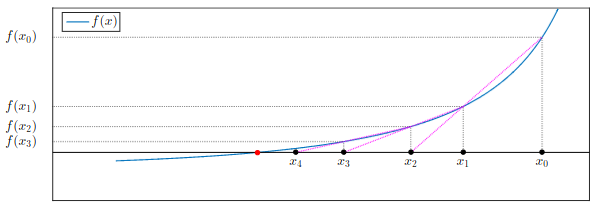

# Metodo delle secanti

Il metodo delle secanti può essere visto come una **variante del metodo di Newton** in cui la derivata prima $f'(x_k)$ viene approssimata tramite un rapporto incrementale.

In questo modo si evita il calcolo esplicito della derivata, rendendo il metodo applicabile anche quando essa non è facilmente disponibile.

La formula iterativa è:

$$
x_{k+1} = x_k - \frac{f(x_k)}{\dfrac{f(x_k) - f(x_{k-1})}{x_k - x_{k-1}}}
$$

che può essere riscritta in forma più compatta come:

$$
x_{k+1} = x_k - f(x_k)\,\frac{x_k - x_{k-1}}{f(x_k) - f(x_{k-1})}
$$

<!-- Immagine Centrata -->

    

## Interpretazione geometrica

Il metodo si basa su un’idea geometrica simile a quella della regula falsi: invece di utilizzare la tangente (come in Newton), si considera la **retta secante** passante per i punti:

$$
(x_{k-1}, f(x_{k-1})) \quad \text{e} \quad (x_k, f(x_k))
$$

Il nuovo punto $x_{k+1}$ è l’intersezione tra questa retta e l’asse delle ascisse.

---

### Struttura iterativa

A differenza del metodo di Newton, che utilizza una sola iterata precedente, il metodo delle secanti ha una **ricorrenza a tre termini**, poiché ogni nuovo valore dipende da:

- $x_{k+1}$ (nuova iterata)
- $x_k$ (iterata precedente)
- $x_{k-1}$ (iterata ancora precedente)

Per questo motivo, il metodo richiede due valori iniziali $x_0$ e $x_1$.

---

### Proprietà e osservazioni

Il metodo delle secanti non richiede il calcolo della derivata, quindi può essere applicato anche a funzioni semplicemente continue. Tuttavia, è comunque necessario che il denominatore:

$$
f(x_k) - f(x_{k-1}) \neq 0
$$

per evitare problemi numerici.

Dal punto di vista della velocità di convergenza, il metodo è più rapido del metodo di bisezione ma, in generale, meno efficiente del metodo di Newton.

La sua convergenza è **superlineare** (con ordine circa $p \approx 1.618$), quindi migliore della convergenza lineare ma inferiore a quella quadratica.

## Conclusione

Il metodo delle secanti rappresenta un buon compromesso tra costo computazionale e velocità di convergenza: elimina la necessità della derivata mantenendo una velocità di convergenza elevata, anche se non garantisce sempre la stessa robustezza dei metodi dicotomici.