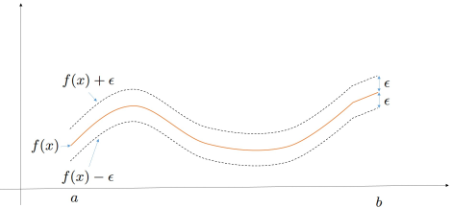
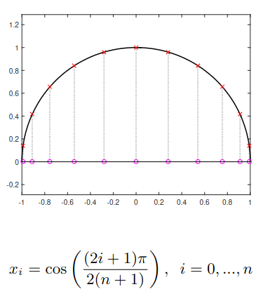

# Approssimazione dell’interpolazione polinomiale ed errore

## Approssimazione polinomiale

Quando utilizziamo un polinomio interpolante $p(x)$ per approssimare una funzione $f(x)$, è fondamentale capire **quanto le due funzioni siano vicine**. Per farlo, introduciamo il concetto di distanza tra funzioni tramite una norma.

Assumiamo che $f : [a,b] \to \mathbb{R}$ sia continua su un intervallo chiuso e limitato. In questo contesto, possiamo definire la **norma infinito** (o norma uniforme) come:

$$
\|f\|_{\infty} = \max_{x \in [a,b]} |f(x)|
$$

Questa norma misura il valore massimo assoluto assunto dalla funzione nell’intervallo.

---

### ▸ Distanza tra funzione e interpolante

Per confrontare la funzione originale $f$ con il polinomio interpolante $p$, consideriamo la norma della loro differenza:

$$
\|f - p\|_{\infty} = \max_{x \in [a,b]} |f(x) - p(x)|
$$

Questa quantità rappresenta **l’errore massimo** tra le due funzioni sull’intero intervallo.

Se vale:

$$
\|f - p\|_{\infty} < \varepsilon
$$

allora significa che, per ogni $x \in [a,b]$:

$$
|f(x) - p(x)| < \varepsilon
$$

cioè:

$$
f(x) - \varepsilon < p(x) < f(x) + \varepsilon
$$

---

### ▸ Interpretazione geometrica

La norma infinito ha un significato molto intuitivo: rappresenta la **massima distanza verticale** tra i grafici di $f$ e $p$.

Dire che:

$$
\|f - p\|_{\infty} < \varepsilon
$$

significa che il grafico del polinomio $p(x)$ è sempre contenuto in una “fascia” di ampiezza $2\varepsilon$ centrata attorno al grafico di $f(x)$.

<!-- Immagine Centrata -->

    

---

### ▸ Qualità dell’approssimazione

Più il valore:

$$
\|f - p\|_{\infty}
$$

è piccolo, migliore è l’approssimazione. In altre parole, il polinomio interpolante descrive fedelmente il comportamento della funzione originale su tutto l’intervallo.

Questo concetto è fondamentale perché permette di valutare **globalmente** la bontà dell’interpolazione, e non solo nei punti in cui i due grafici coincidono (i nodi).

---

### ▸ Osservazione

L’interpolazione garantisce che:

$$
p(x_i) = f(x_i)
$$

nei nodi, quindi l’errore è nullo in quei punti. Tuttavia, tra i nodi l’errore può crescere, ed è proprio la norma infinito che ci permette di quantificare il caso peggiore.

---

## Resto di interpolazione

Il **resto di interpolazione**, o errore di interpolazione, misura la differenza tra la funzione originale e il polinomio interpolante:

$$
\boxed{R_n(x)=f(x)-p_n(x)}
$$

Nei nodi l'errore è sempre nullo, perché il polinomio interpola esattamente la funzione:

$$
R_n(x_i)=f(x_i)-p_n(x_i)=0
$$

Al di fuori dei nodi, invece, generalmente $R_n(x)\neq 0$ e quindi $p_n(x)$ rappresenta un'approssimazione di $f(x)$.

---

### ▸ Formula del resto

Se $f\in C^{n+1}([a,b])$, cioè se la derivata $(n+1)$-esima di $f$ è continua, allora per ogni $x\in[a,b]$ esiste un punto $\xi=\xi(x)\in[a,b]$ tale che

$$
\boxed{
R_n(x)=
\frac{(x-x_0)(x-x_1)\cdots(x-x_n)}{(n+1)!}
f^{(n+1)}(\xi)
}
$$

Introducendo il **polinomio nodale**

$$
\omega(x)=
(x-x_0)(x-x_1)\cdots(x-x_n)
$$

la formula può essere scritta più semplicemente come

$$
\boxed{
R_n(x)=
\frac{\omega(x)}{(n+1)!}
f^{(n+1)}(\xi)
}
$$

Questa formula è importante perché permette di capire **da cosa dipende l'errore**. Esso è determinato da due fattori:

- $f^{(n+1)}(\xi)$ dipende dalla funzione e descrive quanto la funzione varia rapidamente,

- $\omega(x)$ dipende esclusivamente dalla posizione dei nodi.

Il fattore $(n+1)!$ tende invece a ridurre l'errore all'aumentare del grado.

---

### ▸ Interpretazione dell'errore

In particolare, non è sufficiente aumentare semplicemente il numero di nodi per garantire una buona approssimazione. Se i nodi sono scelti in modo sfavorevole, il polinomio nodale può assumere valori molto grandi e l'errore può aumentare, causando forti oscillazioni del polinomio interpolante, come nel **fenomeno di Runge**.

Per ottenere una buona interpolazione è quindi importante scegliere opportunamente la posizione dei nodi. Una scelta particolarmente efficace è costituita dai **nodi di Chebyshev**, che riducono il valore massimo di $|\omega(x)|$ e quindi permettono di controllare meglio l'errore globale.

In sintesi, il resto di interpolazione può essere visto come

$$
\boxed{
\text{errore} =
\underbrace{\frac{1}{(n+1)!}}_{\text{grado}}
\cdot
\underbrace{\omega(x)}_{\text{nodi}}
\cdot
\underbrace{f^{(n+1)}(\xi)}_{\text{funzione}}
}
$$

La formula mostra quindi il ruolo fondamentale di **grado del polinomio, scelta dei nodi e comportamento della funzione** nel determinare la qualità dell'interpolazione.

---

## Il fenomeno di Runge

Il **fenomeno di Runge** è un comportamento indesiderato dell'interpolazione polinomiale in cui, aumentando il numero di nodi, il polinomio interpolante può presentare **forti oscillazioni**, soprattutto vicino agli estremi dell'intervallo.

La formula del resto permette di capire il motivo:

$$
R_n(x)=
\frac{\omega(x)}{(n+1)!}
f^{(n+1)}(\xi)
$$

dove

$$
\omega(x)=
(x-x_0)(x-x_1)\cdots(x-x_n)
$$

dipende esclusivamente dalla posizione dei nodi. Se i nodi vengono scelti in modo inadeguato, come nel caso dei **nodi equispaziati**, il polinomio nodale può assumere valori molto grandi, soprattutto vicino agli estremi dell'intervallo. Di conseguenza, anche il resto di interpolazione può diventare grande e il polinomio interpolante può oscillare fortemente.

Il fenomeno mostra quindi che **aumentare il numero di nodi non garantisce necessariamente una migliore approssimazione**: è fondamentale anche scegliere opportunamente la loro posizione.

Una soluzione consiste nell'utilizzare i **nodi di Chebyshev**, che permettono di controllare meglio il massimo valore di $|\omega(x)|$ e quindi di ridurre l'errore di interpolazione.

In sintesi, il fenomeno di Runge evidenzia l'importanza della **distribuzione dei nodi** nell'interpolazione polinomiale: non conta solamente quanti nodi vengono utilizzati, ma anche **dove vengono posizionati**.

### ▸ Nodi di Chebyshev

I nodi di Chebychev si ottengono partizionando in modo uniforme la semi-circonferenza goniometrica e proiettando i punti di questa partizione sul diametro.

<!-- Immagine Centrata -->

    

### ▸ Proprietà di min-max dei nodi di Chebychev

Si dimostra che costituiscono la scelta dei punti di interpolazione ottimale, nel senso che la quantità

$$
\omega^*_{x_0,\ldots,x_n}
= \max_{x\in[a,b]}
|(x-x_0)\cdot\ldots\cdot(x-x_n)|
$$

calcolata quando $x_0,\ldots,x_n$ sono i nodi di Chebychev è minima rispetto a qualsiasi altra scelta della distribuzione dei nodi.

---