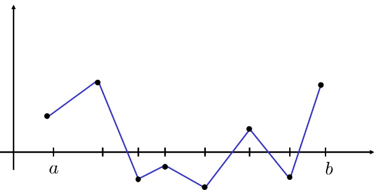

# Interpolazione a tratti

L’interpolazione polinomiale globale presenta alcuni limiti pratici. Il grado del polinomio interpolante cresce infatti con il numero dei nodi: interpolando molti punti, si è costretti a utilizzare un polinomio di grado elevato. Questo può causare problemi numerici e oscillazioni indesiderate, come nel **fenomeno di Runge**.

Un ulteriore limite è che l’interpolazione polinomiale globale richiede di conoscere tutti i punti fin dall’inizio. Se vengono aggiunti nuovi dati, in generale è necessario ricostruire il polinomio interpolante.

Per superare questi problemi si può rinunciare a costruire un unico polinomio globale e utilizzare invece **più polinomi locali**, ciascuno definito su una parte dell’intervallo. Si parla quindi di **interpolazione a tratti**.

### ▸ Idea dell’interpolazione a tratti

L’idea più semplice consiste nel collegare ogni coppia di punti consecutivi con un segmento, ottenendo una funzione spezzata che interpola tutti i dati.

<!-- Immagine Centrata -->

    

La funzione ottenuta non è un unico polinomio su tutto l’intervallo, ma possiede una struttura polinomiale locale: su ciascun sottointervallo coincide con un polinomio di grado $1$.

L’interpolazione a tratti costruisce quindi una funzione che è globalmente una funzione spezzata e localmente, su ciascun intervallo, un polinomio.

Il vantaggio fondamentale è che il numero di nodi viene **disaccoppiato dal grado dei polinomi utilizzati**. Nell’interpolazione polinomiale globale, infatti,

$$
n+1 \text{ nodi}
\quad\Rightarrow\quad
\text{un polinomio di grado } n
$$

mentre nell’interpolazione lineare a tratti,

$$
n+1 \text{ nodi}
\quad\Rightarrow\quad
n \text{ polinomi di grado } 1
$$

In questo modo, anche quando il numero di punti è elevato, si continua a lavorare con polinomi semplici.

### ▸ Suddivisione dell’intervallo

Supponiamo di avere nodi ordinati

$$
x_0 < x_1 < \dots < x_n
$$

che suddividono l’intervallo complessivo nei sottointervalli

$$
I_i=[x_i,x_{i+1}],
\qquad i=0,\dots,n-1
$$

Su ciascun intervallo $I_i$ viene costruito un interpolante locale.

Per valutare l’interpolante in un punto $x$, si individua innanzitutto il sottointervallo $I_i$ a cui appartiene il punto, cioè

$$
x\in[x_i,x_{i+1}]
$$

e successivamente si utilizza il polinomio locale associato a quell’intervallo, costruito a partire dai due punti consecutivi

$$
(x_i,y_i),
\qquad
(x_{i+1},y_{i+1})
$$

### ▸ Interpolante lineare locale

Sul sottointervallo $I_i=[x_i,x_{i+1}]$, la retta interpolante è

$$
p_i(x)
=
y_i+
\frac{y_{i+1}-y_i}{x_{i+1}-x_i}(x-x_i)
$$

oppure, in forma equivalente,

$$
p_i(x)
=
y_i\frac{x-x_{i+1}}{x_i-x_{i+1}}
+
y_{i+1}\frac{x-x_i}{x_{i+1}-x_i}
$$

Questa formula è valida solamente per

$$
x\in[x_i,x_{i+1}]
$$

L’interpolante lineare a tratti è quindi costituito dalla famiglia di polinomi locali

$$
p_0(x),p_1(x),\dots,p_{n-1}(x)
$$

ciascuno associato al proprio sottointervallo.

In questo modo si rinuncia alla semplicità di avere un unico polinomio globale, ottenendo però una maggiore stabilità numerica e una migliore gestione di un numero elevato di dati.

## Interpolazione lineare a tratti: proprietà ed errore

Consideriamo una funzione

$$
f:[a,b]\to\mathbb{R},
\qquad
f\in C^2([a,b])
$$

e una successione di nodi ordinati

$$
a=x_0<x_1<\dots<x_{m}<x_{m+1}=b
$$

che suddivide $[a,b]$ negli intervalli

$$
I_i=[x_i,x_{i+1}],
\qquad i=0,\dots,m
$$

Supponiamo di conoscere i valori della funzione nei nodi:

$$
y_i=f(x_i),
\qquad i=0,\dots,m+1
$$

L’interpolante lineare a tratti, indicato con $s(x)$, è la funzione che su ogni intervallo $I_i$ coincide con la retta passante per i punti consecutivi $(x_i,y_i)$ e $(x_{i+1},y_{i+1})$:

$$
s(x)
=y_i+\frac{y_{i+1}-y_i}{x_{i+1}-x_i}(x-x_i),
\qquad
x\in I_i
$$

Per costruzione,

$$
s(x_i)=f(x_i),
\qquad
i=0,\dots,m+1
$$

La funzione $s(x)$ è continua su tutto $[a,b]$, ma è soltanto **lineare a tratti**: su ogni sottointervallo è un polinomio di grado $1$, mentre globalmente non è un unico polinomio.

### ▸ Resto dell’interpolazione lineare a tratti

Per studiare quanto bene $s(x)$ approssima $f(x)$, fissiamo un sottointervallo

$$
x\in[x_i,x_{i+1}]
$$

e definiamo il resto come

$$
R^s(x)=f(x)-s(x)
$$

Poiché su $[x_i,x_{i+1}]$ stiamo interpolando $f$ mediante un polinomio di grado $1$, possiamo applicare la formula del resto dell’interpolazione polinomiale con due nodi. Esiste quindi un punto

$$
\xi_i\in[x_i,x_{i+1}]
$$

tale che

$$
\boxed{
R^s(x)
=\frac{(x-x_i)(x-x_{i+1})}{2}
f''(\xi_i)
}
$$

Questa formula mostra che l’errore locale dipende sia dalla **curvatura della funzione**, attraverso $f''$, sia dalla posizione di $x$ all’interno del sottointervallo.

### Stima dell’errore locale

Definiamo

$$
M_2^f
=
\max_{x\in[a,b]}|f''(x)|
$$

Poiché $f\in C^2([a,b])$, tale massimo esiste.

Passando al valore assoluto nella formula del resto otteniamo

$$
|f(x)-s(x)|
\le
\frac{|(x-x_i)(x-x_{i+1})|}{2}M_2^f
$$

Per $x\in[x_i,x_{i+1}]$ vale

$$
x-x_i\geq0,
\qquad
x-x_{i+1}\leq0
$$

e quindi

$$
|(x-x_i)(x-x_{i+1})|
=(x-x_i)(x_{i+1}-x)
$$

Da cui

$$
|f(x)-s(x)|
\le
\frac{(x-x_i)(x_{i+1}-x)}{2}M_2^f
$$

### ▸ Massimo del termine geometrico

Consideriamo la funzione

$$
\phi(x)
=(x-x_i)(x_{i+1}-x)
$$

nell’intervallo $[x_i,x_{i+1}]$. Si tratta di una parabola concava, il cui massimo si trova nel punto medio

$$
\tilde{x}
=\frac{x_i+x_{i+1}}{2}
$$

e vale

$$
\phi(\tilde{x})
=
\left(
\frac{x_{i+1}-x_i}{2}
\right)^2
=
\frac{(x_{i+1}-x_i)^2}{4}
$$

Sostituendo questo valore nella stima precedente otteniamo

$$
|f(x)-s(x)|
\le
\frac{1}{2}
\frac{(x_{i+1}-x_i)^2}{4}
M_2^f
$$

e quindi

$$
|f(x)-s(x)|
\le
\frac{(x_{i+1}-x_i)^2}{8}M_2^f,
\qquad
x\in[x_i,x_{i+1}]
$$

Questa è la **stima dell’errore locale** dell’interpolazione lineare a tratti.

### ▸ Stima globale dell’errore

Per ottenere una stima valida su tutto l’intervallo $[a,b]$, definiamo

$$
h=
\max_{i=0,\dots,m}(x_{i+1}-x_i)
$$

cioè la **lunghezza massima dei sottointervalli della partizione**.

Poiché

$$
x_{i+1}-x_i\leq h
$$

per ogni $i$, dalla stima locale segue la stima globale

$$
\boxed{
|f(x)-s(x)|
\le
\frac{h^2}{8}M_2^f,
\qquad
\forall x\in[a,b]
}
$$

Questa è la **stima fondamentale dell’errore** per l’interpolazione lineare a tratti.

### ▸ Caso di nodi equispaziati

Se i nodi sono equispaziati, allora

$$
x_{i+1}-x_i=h
$$

per ogni $i$. In particolare,

$$
x_i=a+ih,
\qquad
i=0,\dots,m+1
$$

con

$$
h=\frac{b-a}{m+1}
$$

La stima globale dell’errore diventa quindi

$$
|f(x)-s(x)|
\le
\frac{h^2}{8}M_2^f,
\qquad
\forall x\in[a,b]
$$

ossia, sostituendo il valore di $h$,

$$
\boxed{
|f(x)-s(x)|
\le
\frac{(b-a)^2}{(m+1)^2}
\frac{M_2^f}{8},
\qquad
\forall x\in[a,b]
}
$$

Facendo tendere il numero dei sottointervalli all’infinito,

$$
m\to+\infty
\quad\Rightarrow\quad
h\to0
\quad\Rightarrow\quad
|f(x)-s(x)|\to0
$$

e quindi

$$
s(x)\to f(x)
\qquad
\text{uniformemente su }[a,b]
$$

### ▸ Ordine dell’errore

La stima

$$
|f(x)-s(x)|
\le
\frac{h^2}{8}M_2^f
$$

mostra che l’errore dell’interpolazione lineare a tratti è dell’ordine

$$
|f(x)-s(x)|=
\boxed{
\mathcal{O}(h^2)
}
$$

Pertanto, dimezzando la distanza $h$ tra i nodi, l’errore si riduce di circa un fattore $4$.

### ▸ Perché non compare il fenomeno di Runge

A differenza dell’interpolazione polinomiale globale, nell’interpolazione lineare a tratti ogni errore dipende localmente dalla lunghezza del singolo intervallo. Non viene quindi costruito un unico polinomio globale di grado elevato che possa produrre oscillazioni indesiderate.

L’errore è infatti controllato dalla quantità $h^2$, attraverso la stima

$$
|f(x)-s(x)|
\le
\frac{h^2}{8}M_2^f
$$

Per questo motivo l’interpolazione lineare a tratti non presenta il **fenomeno di Runge**.

### ▸ Regolarità dell’interpolante

L’interpolante lineare a tratti $s(x)$ è continuo su tutto l’intervallo, perché i segmenti consecutivi condividono gli stessi valori nei nodi. Tuttavia, nei nodi $x_i$ la derivata destra e la derivata sinistra non coincidono in generale.

Pertanto,

$$
s\in C^0([a,b]),
\qquad
s\notin C^1([a,b])
$$

Cioè l'interpolante $s$ è **continua** su $[a,b]$, ma la sua **derivata prima non è continua** su $[a,b]$.

Il limite principale dell’interpolazione lineare a tratti è quindi la sua scarsa regolarità nei nodi.

Questo motiva l’introduzione di interpolanti più regolari, come le **spline cubiche**, che mantengono una struttura a tratti ma migliorano la regolarità della funzione interpolante.

---