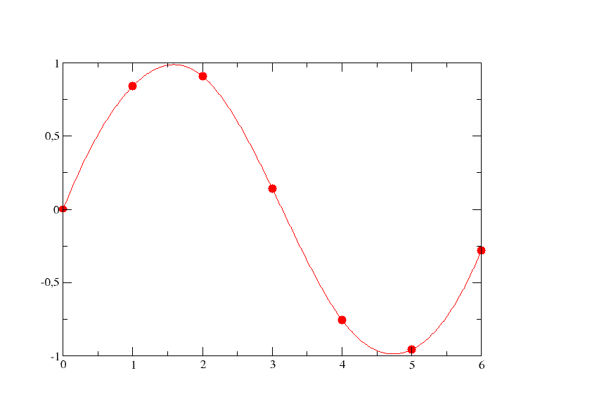

# Interpolazione con funzioni spline

## Definizione di spline

L'interpolazione lineare a tratti permette di evitare l'uso di polinomi globali di grado elevato, ma presenta una limitazione: la funzione ottenuta è continua, ma in generale non è derivabile nei nodi.

Per ottenere un interpolante a tratti più regolare si introducono le **funzioni spline**.

Sia data una partizione dell'intervallo $[a,b]$:

$$
a=x_0<x_1<\dots<x_{m+1}=b
$$

e sia fissato un grado $n\geq 1$. Una **spline di grado $n$** relativa a questa partizione è una funzione $s:[a,b]\to\mathbb{R}$ tale che, su ciascun intervallo

$$
I_i=[x_i,x_{i+1}],
\qquad i=0,\dots,m,
$$

la restrizione di $s$ sia un polinomio di grado al più $n$:

$$
s|_{I_i}=s_i,
\qquad s_i\in\mathbb{P}_n
$$

La spline è quindi una **funzione polinomiale a tratti**, costituita da $m+1$ polinomi:

$$
s_0,s_1,\dots,s_m
$$

## Condizioni di regolarità

Non è sufficiente che i diversi polinomi siano definiti sui rispettivi intervalli: nei nodi interni devono anche raccordarsi in modo regolare.

Per una spline di grado $n$ si richiede:

$$
s\in C^{n-1}([a,b])
$$

cioè $s$ e le sue derivate fino all'ordine $n-1$ devono essere continue su $[a,b]$.

In particolare, in ogni nodo interno $x_{i+1}$ devono coincidere i valori delle derivate dei due polinomi adiacenti:

$$
\begin{cases}
s_i(x_{i+1})=s_{i+1}(x_{i+1})\\
s_i'(x_{i+1})=s_{i+1}'(x_{i+1})\\
\vdots\\
s_i^{(n-1)}(x_{i+1})=s_{i+1}^{(n-1)}(x_{i+1})
\end{cases}
\qquad i=0,\dots,m-1
$$

Queste condizioni impediscono la presenza di discontinuità o spigoli nei punti di raccordo.

In sintesi:

$$
\boxed{
\text{Spline}
=
\text{polinomio a tratti}
+
\text{regolarità nei nodi}
}
$$

## Spline cubiche

Il caso più importante è quello delle **spline cubiche**, cioè spline di grado $3$.

Su ogni intervallo $[x_i,x_{i+1}]$ il tratto è un polinomio di grado al più $3$:

$$
s_i\in\mathbb{P}_3
$$

e la spline deve appartenere a $C^2([a,b])$. Nei nodi interni devono quindi essere continue:

$$
s,\qquad s',\qquad s''
$$

ossia:

$$
\begin{cases}
s_i(x_{i+1})=s_{i+1}(x_{i+1})\\
s_i'(x_{i+1})=s_{i+1}'(x_{i+1})\\
s_i''(x_{i+1})=s_{i+1}''(x_{i+1})
\end{cases}
$$

Le spline cubiche rappresentano un buon compromesso tra regolarità, accuratezza e costo computazionale.

<!-- Immagine Centrata -->

    

## Interpolazione con spline

Dati i punti

$$
(x_i,y_i),
\qquad i=0,\dots,m+1,
$$

con

$$
x_0<x_1<\dots<x_{m+1},
$$

si vuole costruire una spline $s(x)$ che interpoli i dati:

$$
s(x_i)=y_i,
\qquad i=0,\dots,m+1
$$

Nel caso cubico, quindi, cerchiamo una funzione $s$ tale che:

$$
s_i\in\mathbb{P}_3,
\qquad i=0,\dots,m
$$

$$
s\in C^2([a,b])
$$

e

$$
s(x_i)=y_i,
\qquad i=0,\dots,m+1
$$

## Gradi di libertà

Consideriamo una spline di grado $n$. Ogni tratto $s_i$ contiene $n+1$ coefficienti e gli intervalli sono $m+1$, quindi inizialmente abbiamo

$$
(n+1)(m+1)
$$

coefficienti incogniti.

Nei $m$ nodi interni imponiamo la continuità di

$$
s,s',\dots,s^{(n-1)}
$$

e quindi $n$ condizioni per ogni nodo. Complessivamente otteniamo

$$
nm
$$

condizioni di raccordo.

Rimangono quindi

$$
(n+1)(m+1)-nm=n+m+1
$$

gradi di libertà.

L'interpolazione nei $m+2$ nodi impone ulteriori condizioni:

$$
s(x_i)=y_i,
\qquad i=0,\dots,m+1
$$

e quindi rimangono

$$
n+m+1-(m+2)=n-1
$$

gradi di libertà.

Pertanto, le sole condizioni di interpolazione e di raccordo **non determinano in generale univocamente la spline**: sono necessarie ulteriori condizioni al bordo.

Nel caso cubico, $n=3$, rimangono:

$$
n-1=2
$$

gradi di libertà, quindi servono **due condizioni aggiuntive**.

## Condizioni al bordo per le spline cubiche

Le due condizioni aggiuntive vengono imposte agli estremi dell'intervallo e determinano il tipo di spline cubica.

Una scelta comune è la **spline naturale**, per la quale si impone:

$$
s''(x_0)=0,
\qquad
s''(x_{m+1})=0
$$

Un'altra possibilità è la **spline completa (clamped)**, nella quale vengono assegnati i valori delle derivate prime agli estremi:

$$
s'(x_0)=\alpha,
\qquad
s'(x_{m+1})=\beta
$$

Esistono inoltre altre condizioni al bordo, ad esempio le condizioni **periodiche**, utilizzate quando i dati rappresentano un fenomeno ciclico.

Una volta imposte anche le condizioni al bordo, la spline cubica è determinata univocamente e la sua costruzione può essere ricondotta alla risoluzione di un sistema lineare.

## Costruzione della spline cubica

Per costruire una spline cubica è conveniente rappresentare ogni tratto in forma locale rispetto al nodo sinistro dell'intervallo:

$$
s_i(x)
=
\alpha_i
+\beta_i(x-x_i)
+\gamma_i(x-x_i)^2
+\delta_i(x-x_i)^3,
\qquad i=0,\dots,m
$$

Questa forma è particolarmente utile perché semplifica il calcolo delle derivate e l'imposizione delle condizioni di raccordo.

Poiché $s_i$ deve interpolare il dato $(x_i,y_i)$:

$$
s_i(x_i)=y_i
$$

e quindi, sostituendo $x=x_i$:

$$
\boxed{\alpha_i=y_i}
$$

Introduciamo inoltre la lunghezza dell'intervallo:

$$
h_i=x_{i+1}-x_i
$$

Le derivate del tratto sono:

$$
s_i'(x)
=
\beta_i
+2\gamma_i(x-x_i)
+3\delta_i(x-x_i)^2
$$

e

$$
s_i''(x)
=
2\gamma_i
+6\delta_i(x-x_i)
$$

### ▸ Condizione di interpolazione nell'estremo destro

Imponendo

$$
s_i(x_{i+1})=y_{i+1}
$$

e usando $h_i=x_{i+1}-x_i$, si ottiene:

$$
y_i+\beta_i h_i+\gamma_i h_i^2+\delta_i h_i^3=y_{i+1}
$$

### ▸ Continuità della derivata prima

Nel nodo interno $x_{i+1}$ deve essere:

$$
s_i'(x_{i+1})=s_{i+1}'(x_{i+1})
$$

Poiché $x_{i+1}-x_i=h_i$ e $x_{i+1}-x_{i+1}=0$, otteniamo:

$$
\beta_i+2\gamma_i h_i+3\delta_i h_i^2
=
\beta_{i+1}
$$

### ▸ Continuità della derivata seconda

Analogamente:

$$
s_i''(x_{i+1})=s_{i+1}''(x_{i+1})
$$

da cui:

$$
2\gamma_i+6\delta_i h_i
=
2\gamma_{i+1}
$$

Le condizioni precedenti permettono, attraverso opportune sostituzioni, di eliminare parte dei coefficienti e ricondurre la costruzione della spline alla risoluzione di un **sistema lineare**, tipicamente con struttura tridiagonale.

Le due condizioni al bordo completano il sistema e permettono di determinare univocamente la spline.

## Proprietà delle spline cubiche

Le spline cubiche sono particolarmente utilizzate perché combinano i vantaggi dell'interpolazione a tratti con una buona regolarità.

Rispetto all'interpolazione polinomiale globale, permettono di lavorare con polinomi di basso grado sui singoli intervalli, evitando la necessità di costruire un unico polinomio di grado elevato.

Rispetto all'interpolazione lineare a tratti, garantiscono una maggiore regolarità, poiché una spline cubica appartiene a $C^2([a,b])$.

Inoltre, la natura locale della rappresentazione a tratti rende possibile modificare o aggiungere dati senza dover necessariamente ricostruire un unico polinomio globale di grado elevato.

## Spline cubica a curvatura minima

Una proprietà fondamentale delle spline cubiche è la loro interpretazione come curve particolarmente "regolari".

Nel caso appropriato delle condizioni al bordo, la spline cubica interpolante può essere caratterizzata come la funzione che minimizza il funzionale

$$
\int_a^b (s''(x))^2\,dx
$$

tra le funzioni ammissibili che interpolano gli stessi dati.

In altre parole, la spline minimizza una misura della variazione della curvatura e tende quindi a produrre una curva senza curvature e oscillazioni inutili.

Questo fornisce una giustificazione matematica all'idea intuitiva della spline come curva "più dolce" tra quelle che interpolano i dati.

## Errore di interpolazione

Per una spline cubica interpolante, sotto opportune ipotesi di regolarità sulla funzione $f$, l'errore può essere controllato in funzione della massima ampiezza degli intervalli:

$$
h=\max_{i=0,\dots,m}(x_{i+1}-x_i)
$$

Una stima riportata per l'errore sulla funzione è:

$$
\boxed{
|f(x)-s(x)|
\le
h^{3/2}
\left(
\int_a^b (f''(x))^2\,dx
\right)^{1/2}
}
$$

per $x\in[a,b]$.

La stima mostra che, diminuendo $h$, cioè aumentando la densità dei nodi, l'errore diminuisce.

In particolare, se

$$
m\to+\infty
\qquad\Longrightarrow\qquad
h\to0
$$

allora l'errore tende a zero:

$$
|f(x)-s(x)|\to0
$$

È inoltre possibile ottenere una stima anche per la derivata prima:

$$
\boxed{
|f'(x)-s'(x)|
\le
h^{1/2}
\left(
\int_a^b (f''(x))^2\,dx
\right)^{1/2}
}
$$

che mostra come, al diminuire di $h$, anche la derivata prima della spline approssimi sempre meglio quella della funzione.

## Applicazioni

Le spline cubiche sono utilizzate in numerosi contesti in cui è necessario rappresentare curve regolari a partire da dati discreti.

Un esempio è la **grafica computerizzata**, dove curve e contorni possono essere rappresentati mediante punti di controllo e funzioni polinomiali a tratti. La rappresentazione tramite curve consente di modificare, ingrandire o ridurre gli oggetti mantenendo una rappresentazione regolare e scalabile.

Le spline sono quindi uno strumento importante per costruire approssimazioni che combinano:

$$
\boxed{
\text{polinomi di basso grado}
+
\text{regolarità}
+
\text{buone proprietà di approssimazione}
}
$$

---