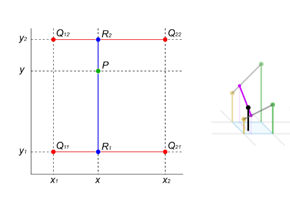

## Interpolazione bidimensionale

L’interpolazione bidimensionale estende il problema dell’interpolazione dal caso monodimensionale al caso di funzioni di due variabili.

Sono dati punti di una griglia del piano:

$$
(x_i,y_j)\in\mathbb R^2
\qquad i=1,\dots,n,\quad j=1,\dots,m
$$

e per ogni coppia di coordinate è assegnato un valore reale:

$$
z_{ij}\in\mathbb R
$$

L’obiettivo è costruire una funzione

$$
g:\mathbb R^2\to\mathbb R
$$

tale che:

$$
g(x_i,y_j)=z_{ij}
\qquad \forall i=1,\dots,n,\; j=1,\dots,m
$$

In questo contesto i punti dati non sono semplicemente una lista di coordinate, ma costituiscono una **griglia cartesiana**: per ogni ascissa $x_i$ si considerano tutte le ordinate $y_j$, ottenendo tutte le combinazioni possibili. Il valore $z_{ij}$ rappresenta allora l’altezza della superficie nel punto $(x_i,y_j)$.

## Interpolazione bilineare

Uno dei metodi più semplici per interpolare dati su una griglia bidimensionale è l’**interpolazione bilineare**.

Nonostante il nome, l’interpolante risultante **non è lineare globalmente**, ma è costruito applicando ripetutamente interpolazioni lineari monodimensionali.

L’idea fondamentale è ridurre il problema 2D a più problemi 1D.

Supponiamo di voler stimare il valore della funzione in un punto interno a un rettangolo della griglia:

$$
(x,y)\in[x_1,x_2]\times[y_1,y_2]
$$

e di conoscere i valori della funzione nei quattro vertici:

$$
z_{11}=g(x_1,y_1),\quad
z_{21}=g(x_2,y_1),\quad
z_{12}=g(x_1,y_2),\quad
z_{22}=g(x_2,y_2)
$$

L’interpolazione bilineare procede in tre passaggi.

1. Si interpola linearmente lungo la direzione $x$ tra i punti inferiori del rettangolo:

    $$
    R_1=
    \frac{x_2-x}{x_2-x_1}z_{11}
    +
    \frac{x-x_1}{x_2-x_1}z_{21}
    $$

    ottenendo una stima intermedia del valore sulla retta $y=y_1$.

2. Si ripete poi la stessa interpolazione lungo $x$ per i punti superiori:

    $$
    R_2=
    \frac{x_2-x}{x_2-x_1}z_{12}
    +
    \frac{x-x_1}{x_2-x_1}z_{22}
    $$

    ottenendo la stima corrispondente sulla retta $y=y_2$.

3. Infine si interpola linearmente lungo la direzione $y$ tra $R_1$ e $R_2$:

    $$
    g(x,y)=
    \frac{y_2-y}{y_2-y_1}R_1
    +
    \frac{y-y_1}{y_2-y_1}R_2
    $$

    Il risultato finale è una funzione che interpola correttamente i quattro vertici del rettangolo e fornisce una stima continua nei punti interni.

<!-- Immagine Centrata -->

    

### ▸ Interpretazione del metodo

L’interpolazione bilineare può quindi essere vista come:

$$
\boxed{
\text{2 interpolazioni lineari lungo }x
\quad+\quad
1\text{ interpolazione lineare lungo }y
}
$$

oppure equivalentemente nel verso opposto (prima lungo $y$, poi lungo $x$): il risultato finale è lo stesso.

### ▸ Caso di griglia uniforme

Se i punti della griglia sono equispaziati, cioè se la distanza tra nodi consecutivi è costante nelle due direzioni, le formule precedenti si semplificano notevolmente.

In tal caso l’interpolazione bilineare può essere interpretata come una **media pesata** dei quattro valori ai vertici del rettangolo, dove i pesi dipendono dalla posizione relativa del punto interno rispetto ai vertici.

### ▸ Applicazioni pratiche

L’interpolazione bilineare è largamente utilizzata in elaborazione numerica e grafica computazionale. Un’applicazione classica è il **ridimensionamento delle immagini raster**, dove i valori dei pixel mancanti vengono stimati interpolando quelli vicini.

È inoltre usata nell’approssimazione di superfici campionate su griglie regolari, nella modellazione di dati sperimentali bidimensionali e nella computer graphics per il texturing e il rendering di superfici.

## Nearest Neighbor Interpolation (interpolazione al vicino più prossimo)

### ▸ Elaborazione delle immagini e interpretazione come superfici

Dal punto di vista numerico, un’immagine digitale può essere interpretata come una **superficie campionata**.

Ogni pixel rappresenta infatti il valore assunto da una funzione su una griglia discreta del piano: nel caso di immagini in scala di grigi, tale valore corrisponde all’intensità luminosa; nel caso di immagini a colori, ciascun pixel memorizza più valori (ad esempio RGB).

In questa prospettiva, elaborare un’immagine equivale spesso a **interpolare o ricampionare una funzione bidimensionale** nota solo in un insieme discreto di punti.

### ▸ Introduzione Nearest Neighbor Interpolation

L’interpolazione **Nearest Neighbor** è il metodo più semplice di interpolazione utilizzato nell’elaborazione delle immagini.

L’idea consiste nell’assegnare a ogni nuovo punto della griglia il valore del **pixel noto più vicino**.

Dal punto di vista matematico, questo corrisponde a costruire una funzione **costante a tratti**, cioè un’interpolazione mediante polinomi di grado zero su ciascun sottointervallo della partizione.

In una dimensione, una funzione costante a tratti assume la forma:

$$
s(x)=y_i
\qquad \text{per } x\in\left[\frac{x_{i-1}+x_i}{2},\frac{x_i+x_{i+1}}{2}\right)
$$

cioè ogni punto assume il valore del nodo più vicino.

Questa funzione **non è continua**, poiché presenta salti nei punti in cui cambia il valore associato al nodo più vicino.

Nel caso bidimensionale, il principio è analogo: ogni nuovo pixel assume il valore del pixel noto geometricamente più vicino nella griglia originale.

### ▸ Interpretazione geometrica nell’ingrandimento delle immagini

Quando si ingrandisce un’immagine, si costruisce una nuova griglia più fitta rispetto a quella originale.

I nuovi pixel introdotti devono essere riempiti assegnando loro un valore, e il metodo Nearest Neighbor lo fa copiando semplicemente il valore del pixel adiacente più vicino.

Questo produce un effetto “a blocchi” o **pixelato**, poiché ogni pixel originale viene sostanzialmente replicato su una regione più ampia.

### ▸ Ricampionamento uniforme della griglia

Supponiamo di partire da una griglia quadrata di dimensione:

$$
n\times n
$$

Se vogliamo raffittire uniformemente la griglia inserendo un nuovo punto **a metà tra ogni coppia di nodi consecutivi** sia orizzontalmente sia verticalmente, allora lungo ciascun asse:

- ai $n$ punti originali si aggiungono $n-1$ nuovi punti intermedi;

quindi il numero totale di punti per asse diventa:

$$
n+(n-1)=2n-1
$$

La nuova griglia avrà dunque dimensione:

$$
(2n-1)\times(2n-1)
$$

### ▸ Raffinamenti multipli della griglia

Se il processo di raffinamento viene ripetuto più volte, il numero di punti cresce ricorsivamente.

Dopo $k$ raffinamenti uniformi, il numero di punti per asse diventa:

$$
2^k(n-1)+1
$$

e quindi la dimensione complessiva della griglia è:

$$
\boxed{
\big(2^k(n-1)+1\big)\times\big(2^k(n-1)+1\big)
}
$$

Questa formula descrive correttamente l’aumento di risoluzione quando si inseriscono iterativamente punti medi tra quelli esistenti.

### ▸ Osservazione

L’interpolazione Nearest Neighbor è estremamente veloce e semplice da implementare, ma produce risultati visivamente poco regolari.

Per questo motivo viene spesso usata quando:

- la velocità di calcolo è prioritaria;
- si vuole preservare l’aspetto “a pixel” dell’immagine (ad esempio in pixel art);
- non è richiesta continuità o morbidezza visiva.

Quando invece si desiderano immagini ingrandite più lisce e naturali, si preferiscono metodi più sofisticati come l’interpolazione bilineare o bicubica.

---