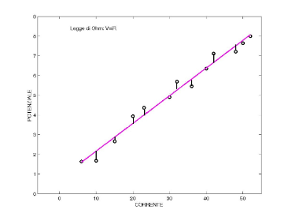

# Criterio dei Minimi Quadrati

## Limiti dell’interpolazione in presenza di dati rumorosi

L’**interpolazione** classica assume che i dati assegnati siano esatti, cioè privi di errori. Nella pratica, però, i dati sperimentali ottenuti da misurazioni contengono quasi sempre **rumore, errori strumentali o perturbazioni casuali**.

Se si applica un metodo di interpolazione a dati rumorosi, la funzione interpolante viene forzata a passare esattamente per ogni punto misurato, compresi quelli alterati dal rumore. Di conseguenza, l’interpolante può seguire anche le oscillazioni spurie presenti nei dati, risultando poco rappresentativo del fenomeno reale sottostante.

Ad esempio, supponiamo che un fenomeno fisico segua teoricamente una legge lineare come la legge di Ohm

$$
V=iR
$$

dove $R$ è la resistenza, supposta costante. Le misurazioni reali di tensione e corrente non cadranno generalmente esattamente su una retta, ma saranno distribuite attorno ad essa a causa degli errori sperimentali.

Interpolare questi dati significherebbe costruire una funzione che passa esattamente per tutte le misurazioni, seguendo quindi anche il rumore. In questi casi è più conveniente **approssimare l’andamento generale dei dati** invece di imporre il passaggio esatto per ogni punto.

Il criterio dei **minimi quadrati** nasce proprio da questa esigenza.

## Minimi Quadrati

L’idea alla base della regressione è scegliere una funzione appartenente a una determinata famiglia di modelli e determinare i parametri che la rendono il più possibile vicina ai dati osservati.

A differenza dell’interpolazione, non imponiamo che il modello passi per tutti i punti. Cerchiamo invece il modello che, complessivamente, si discosta meno dai dati secondo una determinata misura dell’errore.

Per prima cosa bisogna scegliere un **modello matematico** ritenuto adatto a descrivere il fenomeno. Nel caso più semplice si considera un modello lineare, cioè una retta.

### ▸ Retta di regressione

Dato un insieme di punti sperimentali

$$
(x_i,y_i),
\qquad i=0,\dots,m
$$

si cerca la retta

$$
y=a_0+a_1x
$$

che approssima al meglio i dati.

L’obiettivo intuitivo è trovare la retta che passa il più vicino possibile ai punti sperimentali.

### ▸ Funzione obiettivo dei minimi quadrati

Per misurare quanto bene la retta approssima i dati, consideriamo lo scarto verticale tra il valore osservato $y_i$ e il valore predetto dalla retta:

$$
a_0+a_1x_i-y_i
$$

Questo scarto viene chiamato **residuo**.

Non possiamo semplicemente sommare i residui perché alcuni potrebbero essere positivi e altri negativi, compensandosi tra loro. Si considera quindi il quadrato dei residui e si definisce la funzione obiettivo

$$
\boxed{
Q(a_0,a_1)
=
\sum_{i=0}^{m}
(a_0+a_1x_i-y_i)^2
}
$$

La **retta di regressione ai minimi quadrati** è la retta per cui $Q(a_0,a_1)$ assume il valore minimo.

In altre parole, si cercano $a_0$ e $a_1$ tali che

$$
\boxed{
(a_0,a_1)
=
\operatorname*{arg\,min}_{(a_0,a_1)}Q(a_0,a_1)
}
$$

### ▸ Interpretazione geometrica

Il metodo dei minimi quadrati minimizza la somma dei quadrati degli **scarti verticali** tra i dati e il modello.

Questi scarti non sono le distanze euclidee tra i punti e la retta: si misura esclusivamente la componente dell’errore lungo l’asse $y$.

Questa scelta equivale, dal punto di vista del modello, ad assumere che l’errore sia associato principalmente alla variabile osservata $y$, mentre le ascisse $x_i$ vengono considerate note.

<!-- Immagine Centrata -->

    

## Formulazione matriciale del problema

La formulazione matriciale permette di trattare la retta, la parabola, i polinomi di grado arbitrario e, più in generale, modelli costruiti come combinazione lineare di funzioni assegnate con un unico formalismo.

### ▸ Caso della retta ($n=1$)

Consideriamo il vettore dei valori predetti dalla retta:

$$
\begin{pmatrix}
a_0+a_1x_0\\
a_0+a_1x_1\\
\vdots\\
a_0+a_1x_m
\end{pmatrix}
$$

e il vettore dei dati osservati:

$$
y=
\begin{pmatrix}
y_0\\
y_1\\
\vdots\\
y_m
\end{pmatrix}
$$

La differenza tra questi due vettori contiene tutti i residui:

$$
\begin{pmatrix}
a_0+a_1x_0-y_0\\
a_0+a_1x_1-y_1\\
\vdots\\
a_0+a_1x_m-y_m
\end{pmatrix}
$$

Ricordiamo che, per un vettore $v\in\mathbb R^m$,

$$
\|v\|_2
=
\sqrt{\sum_i v_i^2}
$$

e quindi

$$
\|v\|_2^2
=
\sum_i v_i^2
$$

Pertanto la somma dei quadrati dei residui può essere espressa tramite la norma euclidea:

$$
Q(a_0,a_1)
=
\left\|
\begin{pmatrix}
a_0+a_1x_0\\
a_0+a_1x_1\\
\vdots\\
a_0+a_1x_m
\end{pmatrix}
-
\begin{pmatrix}
y_0\\
y_1\\
\vdots\\
y_m
\end{pmatrix}
\right\|_2^2
$$

Introduciamo ora la matrice

$$
A=
\begin{pmatrix}
1 & x_0\\
1 & x_1\\
\vdots & \vdots\\
1 & x_m
\end{pmatrix}
\in\mathbb R^{(m+1)\times2}
$$

e il vettore dei parametri

$$
\alpha=
\begin{pmatrix}
a_0\\
a_1
\end{pmatrix}
\in\mathbb R^2
$$

Si ha allora

$$
A\alpha
=
\begin{pmatrix}
a_0+a_1x_0\\
a_0+a_1x_1\\
\vdots\\
a_0+a_1x_m
\end{pmatrix}
$$

e quindi il problema diventa

$$
\boxed{
Q(\alpha)=\|A\alpha-y\|_2^2
}
$$

Questa è la **forma fondamentale del problema dei minimi quadrati lineari**.

Nel caso della retta, $A$ coincide con le prime due colonne della matrice di Vandermonde associata ai punti $x_i$.

### ▸ Caso della parabola ($n=2$)

Consideriamo ora il modello quadratico

$$
f(x)=a_0+a_1x+a_2x^2
$$

e cerchiamo i coefficienti $a_0,a_1,a_2$ che minimizzano

$$
Q(a_0,a_1,a_2)
=
\sum_{i=0}^{m}
(a_0+a_1x_i+a_2x_i^2-y_i)^2
$$

La matrice di regressione diventa

$$
A=
\begin{pmatrix}
1 & x_0 & x_0^2\\
1 & x_1 & x_1^2\\
\vdots & \vdots & \vdots\\
1 & x_m & x_m^2
\end{pmatrix}
$$

mentre

$$
\alpha=
\begin{pmatrix}
a_0\\
a_1\\
a_2
\end{pmatrix}
$$

Anche in questo caso

$$
\boxed{
Q(\alpha)=\|A\alpha-y\|_2^2
}
$$

### ▸ Caso generale: polinomio di grado $n$

Consideriamo il polinomio

$$
p_n(x)
=
a_0+a_1x+a_2x^2+\dots+a_nx^n
$$

La funzione obiettivo è

$$
Q(a_0,\dots,a_n)
=
\sum_{i=0}^{m}
\left(
a_0+a_1x_i+\dots+a_nx_i^n-y_i
\right)^2
$$

La matrice di regressione è

$$
A=
\begin{pmatrix}
1 & x_0 & x_0^2 & \dots & x_0^n\\
1 & x_1 & x_1^2 & \dots & x_1^n\\
\vdots & \vdots & \vdots & & \vdots\\
1 & x_m & x_m^2 & \dots & x_m^n
\end{pmatrix}
\in\mathbb R^{(m+1)\times(n+1)}
$$

e

$$
\alpha=
\begin{pmatrix}
a_0\\
a_1\\
\vdots\\
a_n
\end{pmatrix}
$$

Pertanto

$$
\boxed{
Q(\alpha)=\|A\alpha-y\|_2^2
}
$$

La matrice $A$ è una matrice di Vandermonde rettangolare.

### ▸ Caso generale: combinazione lineare di funzioni

Il metodo non è limitato ai polinomi.

Possiamo scegliere un insieme di funzioni assegnate

$$
\phi_0,\phi_1,\dots,\phi_{n-1}
$$

e costruire il modello

$$
f(x)
=
a_0\phi_0(x)
+a_1\phi_1(x)
+\dots
+a_{n-1}\phi_{n-1}(x)
$$

Le funzioni $\phi_i$ possono essere, ad esempio,

$$
1,\quad x,\quad x^2,\quad \sin(x),\quad \cos(x),\quad e^x,\quad \log(x),\dots
$$

Il modello viene detto **lineare nei parametri** perché i coefficienti $a_0,\dots,a_{n-1}$ compaiono linearmente. Le funzioni $\phi_i$ possono invece essere non lineari rispetto a $x$.

La funzione obiettivo è

$$
Q(a_0,\dots,a_{n-1})
=
\sum_{i=0}^{m}
\left(
\sum_{j=0}^{n-1}a_j\phi_j(x_i)-y_i
\right)^2
$$

Definiamo la matrice di regressione

$$
A=
\begin{pmatrix}
\phi_0(x_0) & \phi_1(x_0) & \dots & \phi_{n-1}(x_0)\\
\phi_0(x_1) & \phi_1(x_1) & \dots & \phi_{n-1}(x_1)\\
\vdots & \vdots & & \vdots\\
\phi_0(x_m) & \phi_1(x_m) & \dots & \phi_{n-1}(x_m)
\end{pmatrix}
$$

e

$$
\alpha=
\begin{pmatrix}
a_0\\
a_1\\
\vdots\\
a_{n-1}
\end{pmatrix}
$$

Si ottiene nuovamente

$$
\boxed{
Q(\alpha)=\|A\alpha-y\|_2^2
}
$$

Questa formulazione è importante perché permette di trattare con lo stesso strumento molti modelli differenti.

---